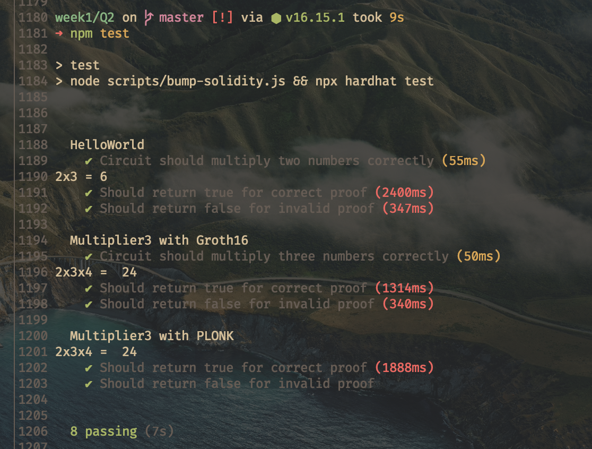

# ZKU week 1 solutions

## part 1

**1.** SNARK relies on elliptic curve cryptography, the keys used to create and verify keys are linked by a set of parameters that must remain hidden for SNARK to be secure. Thus a trusted setup is needed to ensure the parameters can't be reconstructed. In contrast START uses hash functinons for cryptography and only assumes that they are collision free.

**2.** SNARK proofs are significantly smaller and cheaper to verify on chain than STARK proofs. STARK proofs can be constructed faster due to lower algorithmic complexity.

## part 2

**2.1** the circuit receives 2 inputs (a and b) and multiplies them. the result is the output c

**2.2** ZK-Snarks requires a trusted setup. this means a piece of data is needed for generating a proof. Generating this data requires knowledge of a secret s. The setup is 'trusted' because anyone in possession of s could produce forged proofs. A Powers of Tau ceremony is a setup scheme where N participants extend the setup data with their chosen secret. If at least one of them is honest and destroys the secret, it will be infeasible to reconstruct the full secret.

**2.3** In phase 2 trusted setup we contribute our own randomness to the key. This step is specific to our proof.

**3.2** Non quadratic constraints are not allowed! SNARK can only be applied to quadratic arithmetic programs, while any computation can be expressed as such, the conversion to QAP is non trivial.

**4.1** We do not need a second cermony specific to the circuit. 

**4.2** The benefit of requiring less setup comes with some downsides. PLONK verification is slower (1888ms vs 1314ms in the case of our tests) and the PLONK verifier contract is twice the size of the groth16 contract (12K vs 24K).

**5.3** 

## part 3

**1.1** the `LessThan` template takes the number of bits of its input as an argument. In this case `32`

**1.2** `adder.out` will be the binary result of the addition of both of our inputs. `LessThan` otputs the last bit of `adder.out`, thus the output will either be 0 or 1.

**2.2** the error is: `circuit too big for this power of tau ceremony. 70534 > 2**16`. We know that $70534 < 2^{17}$ so we can resolve the error by using the `powersOfTau28_hez_final_17.ptau` instead. We want to use to use the smallest possible tau ceremony for performance reasons.

